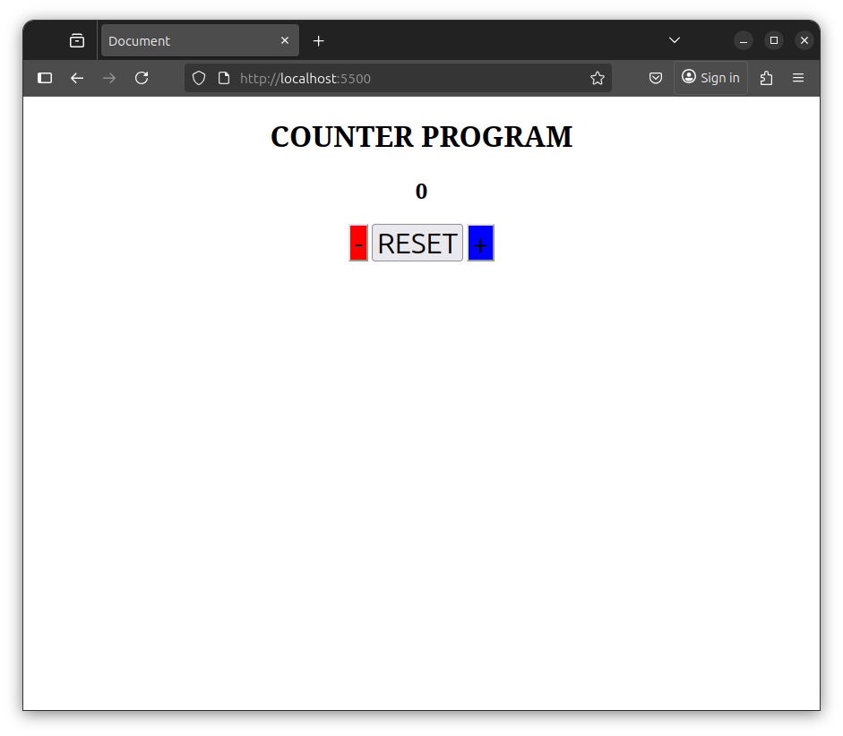

# Simple Counter App

A basic web application that allows users to increase, decrease, or reset a numerical counter by clicking buttons.

## Features

- **Plus (+) button:** Increases the counter by 1
- **Minus (−) button:** Decreases the counter by 1
- **Reset button:** Resets the counter back to 0
- Color-coded buttons for easy use:
  - Minus button is red
  - Plus button is blue
  - Reset button blends with the background

## Screenshot

## How to Run

1. Clone or download this repository.
2. Open the `index.html` file in your preferred web browser.
3. Use the buttons to interact with the counter.

## File Structure
/your-project
/images
screenshot.png
index.html
script.js
styles.css

## Technologies Used

- HTML
- CSS
- JavaScript
